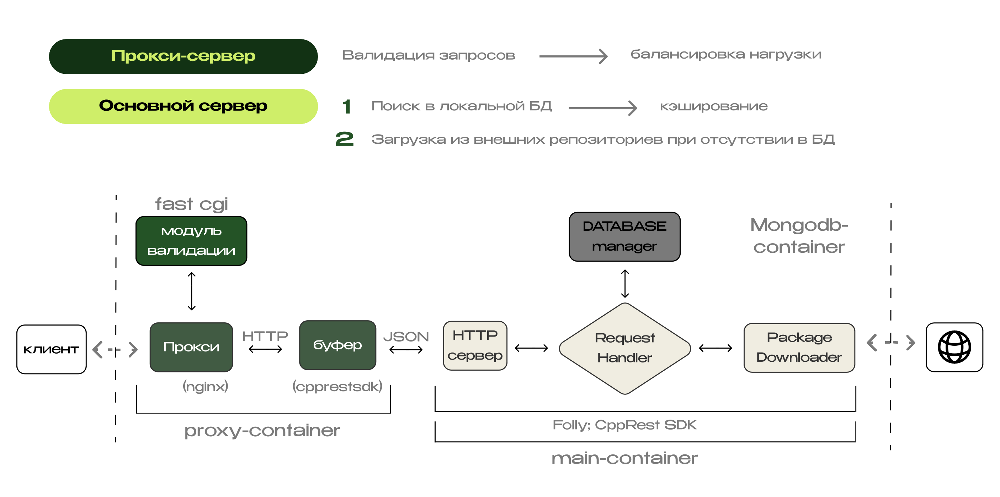
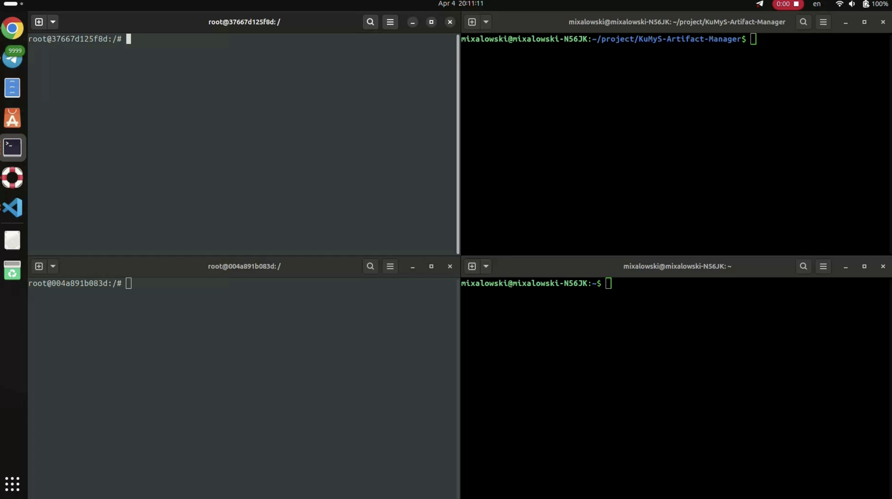

# KuMyS-Artifact-Manager

#### Локальный менеджер репозиториев для корпоративных сетей
Обеспечить безопасную, быструю и контролируемую установку пакетов в корпоративных сетях, не имеющих прямого доступа к интернету. Проект позволяет администраторам централизованно управлять источниками пакетов и кэшировать их для последующих установок.

Основной функционал:
* Проксирование и кэширование пакетов из одобренных внешних репозиториев.
* Безопасность за счёт использования проверенных источников и контроля на уровне сети.
* Повышение скорости установки за счёт хранения часто используемых пакетов локально.
* Интеграция с системными пакетными менеджерами (например, apt).
* Поддержка Docker для лёгкого развёртывания.
* Веб-интерфейс для администрирования репозиториев и загрузок с возможностью блокировок устройств. 

#### Архитектура


#### Демо-видео работы серверной части
Левые терминалы выступают в качестве клиентов, а правые в качестве нашего сервиса.
* `0:00` - Верхний клиент выполняет `apt update`, но получает ошибку — нет доступа к интернету.
* `0:07` - В верхнем терминале происходит создание инфраструктуры через Docker

     `0:19` - В нижнем вход в proxy контейнер и его дальнейший запуск

     `0:26` - В верхнем вход в main контейнер и его запуск
* `0:31` - Верхний клиент запускает установочный скрипт, связывающий его с proxy. Повторяет `apt update` — теперь обновление проходит успешно, несмотря на отсутствие прямого доступа к интернету

    `0:41` -  Затем устанавливается тестовый пакет за 7 сек

* `0:45` - Нижний клиент запускает установочный скрипт и выполняет `apt update`

    `0:56` - Теперь он устанавливает тот же пакет — за счёт кэширования загрузка занимает всего пару секунд (в 3 раза быстрее)

[](https://www.dropbox.com/scl/fi/2afd5mwom28p318n69ovz/demo.mp4?rlkey=wkkburo0b646oe76vhmityzhe&st=akk66l2l&dl=04)

#### Демо-видео работы панели администратора
Аккаунт администратора создается утилитой htpasswd в папке `\proxy\admin-assets\`. По умолчанию логин: `admin`, пароль: `admin`
* `0:00` - Авторизация в панели администратора и блокировка пользователя
* `0:00` - Демонстрация того, что обращение от заблокированного пользователя не проходит дальше модуля валидации на проксе-сервере
* `0:00` - Разблокирование пользователя и демонстрация успешного обращения от него к нашем серверу

## Руководство по эксплуатации
### Используемые библиотеки: 
* common: CppRestSDK, Folly (async), gtest
* main-server: MongoDB, mongocxx
* proxy-server: Openresty (nginx, lua), FastCGI++ by Eddie Carle
<!-- Надо будет закрепить версии. Надо будет переделать данные раздел в иконки -->

Протестировано на Docker Ubuntu 24.04

### Docker
1) Собрать все контейнеры:
    ```bash
    docker-compose up -d --build
    ```
2) Зайти в соответствующий контейнер: app, proxy
    ```bash
    docker exec -it <name> bash
    ```

### Main-server
1) Собрать проект:
    ```bash
    cmake .. && make
    ```
2) Запустить сервер:
    ```bash
    ./kumys_server
    ```

### Proxy-server
**Важно**: на данном этапе разработки скрипты зависимы от папки, в которой они лежат
1) Собрать проект:
    ```
    ./scripts/proxy-server/build_modules.sh
    ```
2) Запустить nginx, который так же выведет адрес, на котором будут ждать запросы от клиентов. Остановить его можно дополнительным аргументом stop\
    **Важно**: перед повторным запуском необходимо остановить уже запущенный
    ```bash
    ./scripts/proxy-server/start_nginx.sh
    ```
    ```bash
    ./scripts/proxy-server/start_nginx.sh stop
    ```
3) Запустить панель администрирования:
    ```bash
    ./scripts/proxy-server/start_admin_panel.sh
    ```
4) В отдельном терминале запустить модуль валидации запросов:
    ```bash
    ./scripts/proxy-server/start_validate_module.sh
    ```
5) В отдельном терминале запустить буффер между nginx и main-server'ом, указав в аргументах ip и port main-server'а:
    ```bash
    ./scripts/proxy-server/start_buffer.sh <ip> <port>
    ```

В данной инструкции не отражена возможность изменить порты модулей, как и возможность запустить модули на разных машинах. Todo

Краткая схема того, как связаны модули на дефолтных портах:
```c++
// Ports:                   <-> (63340) admin_panel
// client <-> (63380) nginx <-> (63350) validate_module
//                          <-> (63360) buffer (63370)  <-> (ip, port) main-server 
```

### Client
Изменить список репозиториев apt get, запустив скрипт `apt_config.sh`, указав ip адрес и порт, на котором развернут nginx сервер
```bash
./scripts/apt_config.sh <ip> <port>
```
Пометка: список репозитеориев хранится в `/etc/apt/sources.list.d`

##
**Авторы**: `Дунаев С.` `Мельников К.` `Михаловский М.`

#### ЗДЕСЬ ВСЕ ЕЩЕ МОГЛА БЫ БЫТЬ ВАША РЕКЛАМА!